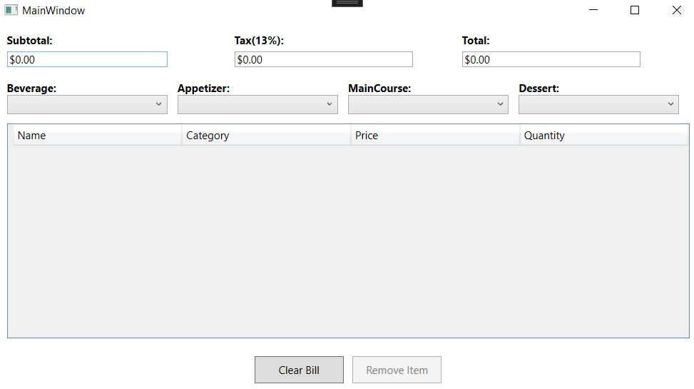
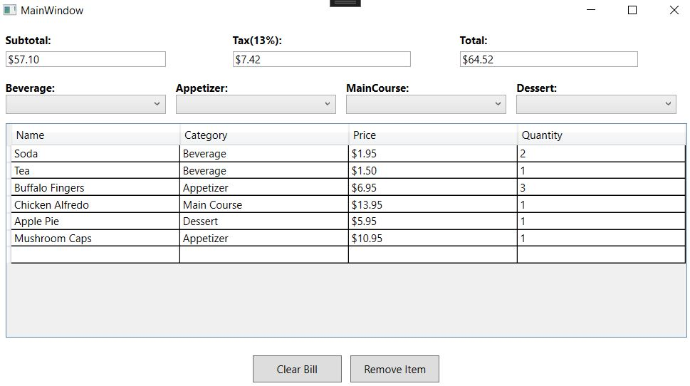
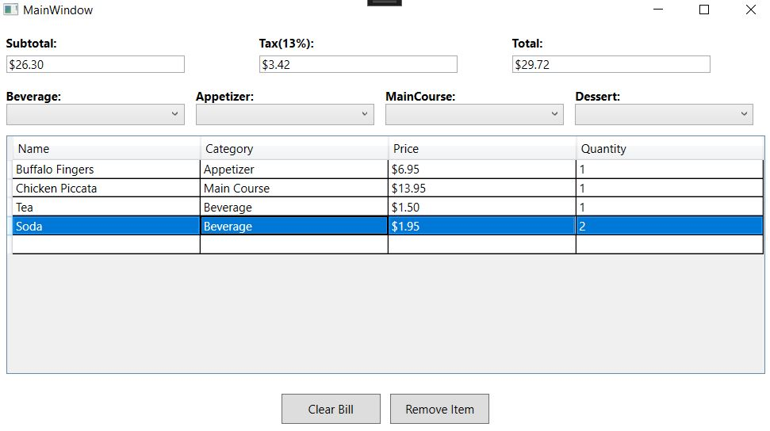
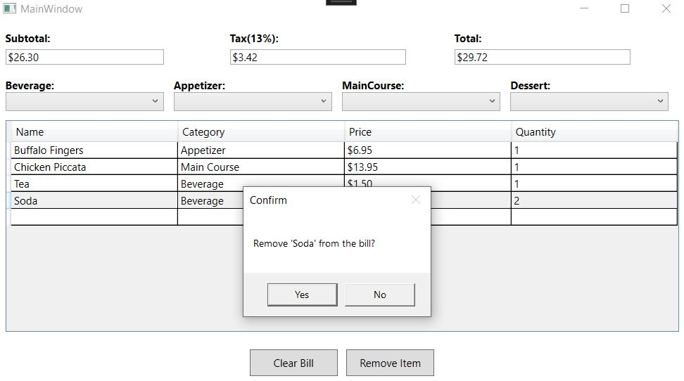
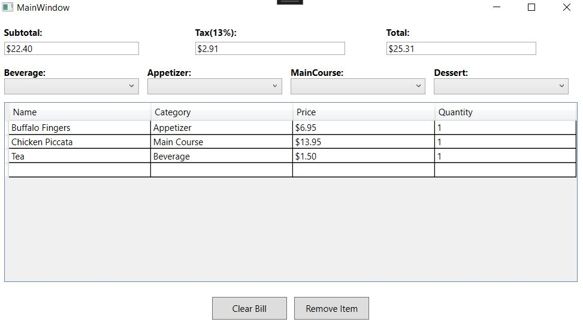

# Restaurant Bill Calculator
## Requirements
A restaurant wants a WPF app that calculates a table’s bill. The app should display all following menu items (shown below) in four ComboBoxes. Each ComboBox should contain a category of food offered by the restaurant (Beverage, Appetizer, Main Course and Dessert).
The user can choose from one of these ComboBoxes to add an item to a table’s bill. As each item is selected in the ComboBoxes, add to the DataGrid Control, and add the price of that item to the bill. The user can click the Clear Bill Button to restore the Subtotal:, Tax: and Total: fields to $0.00. 
### 1.  Selected item(s) from combo box is added to the DataGrid row; if the selected item(s) exists in the DataGrid, change the quantity of the corresponding items rather than add new row  
### 2.  The selected item can be removed from the DataGrid  
### 3.  The quantity can be updated directly in DataGrid  
### 4.  The invoice is generated correctly 

## Screenshots
 
 
 
 
 
